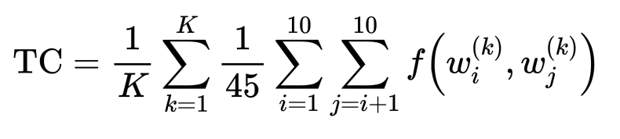
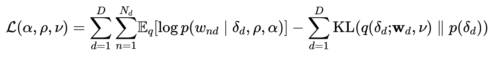

# ETM in Pytorch Lightning
Implementation in [Pytorch Lightning](https://pytorch-lightning.readthedocs.io/en/stable/) of the [Embedded Topic Modeling](https://arxiv.org/abs/1907.04907) (ETM) by Adji B. Dieng, Francisco J. R. Ruiz, and David M. Blei. This repository is largely based 
on the original [code]( https://github.com/adjidieng/ETM).

# Installation
First or all, download or clone this repository and open a terminal on the root folder. Then create a conda environment with 

`
conda create --name etm-lightning python=3.7.9 --no-default-packages
`

and activate the conda environment

`
conda activate etm-lightning
`

Secondly, install pip

`
conda install -c anaconda pip
`

finally install all the dependencies with

`
pip install -r requirements.txt
`

# Usage
Run the file `main.py ` with the configuration file as argument to train the ETM model

`python main.py -f config.yaml`

At the end of the execution, the trained model will be stored as well as a summary of the training in TensorBoard. 
To visualize the summary, open a terminal window and run 

`tensorboard --logidr EXPERIMENTS_ROOT_PATH`


# Configuration file

Use the configuration file to define i) the dataset ii) the ETM hyperparamters and iii) the training details.
Below you can find an example of this file with a short explanation of the main hyperparameters

```
seed: 1 # Initialization for the random number generator
root_dir: experiments # Root folder to save the model and TensorBoard data
dataset:
  name: 20ng
  params:
    data_dir: ./data/20ng
    batch_size: 64
    num_workers: 0
model:
  name: etm
  params:
    num_topics: 50 # Number of topics
    vocab_size: null # Number of words in the vocabulary. This will be filled automatically
    t_hidden_size: 128 # Dimension of the hidden layer of the inference NNs
    rho_size: 300 # Dimension of the embedding spac
    theta_act: relu # Non-linear activation function for the NNs
    enc_drop: 0.3 # Percentage of dropout
optimizer:
  name: adam
  params:
    lr: 0.002
    weight_decay: 1.2e-6 # L2 regularization
scheduler:
  name: step_lr
  params:
    step_size: 10
    gamma: 0.5
trainer:
  max_epochs: 10 # Maximum number of epochs to train
  min_epochs: 1 # Min number of epochs to train
  limit_train_batches: 1.0
  limit_val_batches: 1.0
  limit_test_batches: 1.0
  check_val_every_n_epoch: 2
  progress_bar_refresh_rate: 1
  flush_logs_every_n_steps: 100
  log_every_n_steps: 2 # How often to add logging rows (does not write to disk)
  precision: 32
  automatic_optimization: True
  terminate_on_nan: True
  auto_select_gpus: True
  deterministic: True
  gpus: null # number of gpus to train on (int) or which GPUs to train on (list or str) applied per node
  num_sanity_val_steps: 2
  track_grad_norm: -1 # Otherwise tracks that norm (2 for 2-norm)
```

# Dataset

The code works with any dataset in Bag of Words format, a.k.a. `corpus`. To use your own dataset, you just have to create a 
a LightningDataModule subclass where you have to specify:
- `size_of_your_vocab`
- `train_corpus`
- `valid_corpus`
- `test_corpus`

Your custom LightningDataModule should look something like this.
```
class YourDatasetDataModule(LightningDataModule):
    name = "your_dataset"

    def __init__(
            self,
            data_dir: str = "./",
            num_workers: int = 16,
            batch_size: int = 32,
            *args,
            **kwargs,
    ):
        """
        Args:
            data_dir: where to save/load the data
            num_workers: how many workers to use for loading data
            batch_size: size of batch
        """
        super().__init__(*args, **kwargs)

        self.data_dir = data_dir
        self.num_workers = num_workers
        self.batch_size = batch_size
        ...

    @property
    def vocab_size(self):

        return size_of_your_vocab


    def train_dataloader(self):

        loader = DataLoader(
            CorpusDataset(train_corpus),
            batch_size=self.batch_size,
            shuffle=True,
            num_workers=self.num_workers,
            drop_last=True,
            pin_memory=True,
        )
        return loader

    def val_dataloader(self):

        loader = DataLoader(
            CorpusDataset(valid_corpus),
            batch_size=self.batch_size,
            shuffle=True,
            num_workers=self.num_workers,
            drop_last=True,
            pin_memory=True,
        )
        return loader

    def test_dataloader(self):
        loader = DataLoader(
            CorpusDataset(test_corpus),
            batch_size=self.batch_size,
            shuffle=True,
            num_workers=self.num_workers,
            drop_last=True,
            pin_memory=True,
        )
        return loader
```

Then adapt `dataset` part of the configuration to handle the dataset parameters and name. Finally, in `main.py` add the following line
```
data_module = None
if cfg['dataset']['name'] == Cte.YOUR_DATASET:
    from datasets.your_dataset import YourDatasetDataModule
    data_module = YourDatasetDataModule(**cfg['dataset']['params'])
``` 

and you should be really to train!

# Evaluation metrics
This information is extracted directly from the original paper
#### Topic diversity
Percentage of unique words in the top 25 words of all topics
#### Topic coherence
Average pointwise mutual information of two words drawn randomly from the same document


#### Evidence Lower BOund (ELBO)



## Acknowledgments

- "[Topic Modeling in Embedding Spaces](https://arxiv.org/abs/1907.04907)" by Adji B. Dieng, Francisco J. R. Ruiz, and David M. Blei.
- The original code can be found [here]( https://github.com/adjidieng/ETM).

# Contact

If you have any question, please don't hesitate to contact me at <psanch2103@gmail.com>